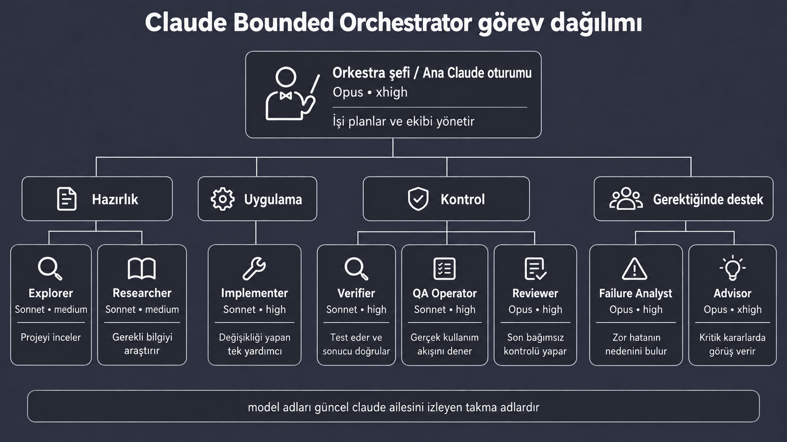
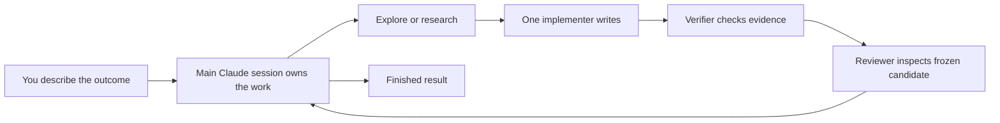

[English](README.md) · [Türkçe](README.tr.md)

# Claude Bounded Orchestrator

[](LICENSE)
[](https://www.python.org/downloads/)

**A small, reviewable team structure for complex Claude Code work.**

Claude Bounded Orchestrator gives the main Claude session clear ownership, separates investigation from implementation, keeps one writer per scope, and requires independent verification before completion. A private local ledger tracks short task metadata so dependent steps are less likely to be skipped.

You still ask for work in normal language. The project supplies the operating rules behind the scenes.



The visual overview uses short Turkish labels. Version 0.3.0 adds guided model/effort profiles and an optional proposal-only OpenAI role; the default routing remains listed below.



## Why use it?

- **One accountable owner:** the main session decides scope, routing, integration, and the final result.
- **One writer per scope:** only the implementer receives `Edit` and `Write` tools.
- **Independent checks:** verification and review are separate from implementation.
- **Bounded delegation:** project agents cannot create more agents; native spawn depth is capped at `1`.
- **Finite repair loops:** failed verification or review can trigger a focused repair, not an endless loop.
- **Completion gating:** dependencies and unfinished work remain visible in a lightweight local ledger.
- **Optional expertise:** UI design and security guidance are available only when explicitly invoked and grant no tools.
- **Safe installation:** existing Claude settings and conflicting managed files are preserved by default.
- **Guided profiles:** choose balanced, quality, economy, or configure every role during one-click setup.
- **Optional GPT proposals:** a local MCP bridge can call the OpenAI Responses API without giving the external model workspace access.

## Quick start

Requirements:

- A current [Claude Code installation](https://code.claude.com/docs/en/getting-started)
- Python 3.11 or newer

Clone or download this repository, then preview installation into your project:

```bash
python scripts/install.py /path/to/your-project --dry-run
python scripts/install.py /path/to/your-project
```

For a guided Turkish setup on macOS/Linux, run `./setup.command /path/to/your-project`. On Windows, run `setup.ps1` or double-click `setup.cmd`. The setup asks you to choose `balanced`, `quality`, `economy`, or `custom`. Custom setup asks for the model and effort of the owner and every agent.

The direct installer stays non-interactive and uses `balanced` unless you choose another profile:

```bash
python scripts/install.py /path/to/your-project --preset economy
python scripts/install.py /path/to/your-project --preset custom \
  --role-model implementer=opus --role-effort implementer=xhigh
```

Custom model values accept provider model IDs containing letters, digits, dots, underscores, and hyphens. The main Claude session accepts `low`, `medium`, `high`, or `xhigh`; child-agent frontmatter additionally accepts `max`.

On Windows PowerShell:

```powershell
.\scripts\install.ps1 -Target C:\path\to\your-project -DryRun
.\scripts\install.ps1 -Target C:\path\to\your-project
```

Open the target project in Claude Code and describe the outcome normally:

```text
Find why checkout sometimes creates duplicate orders, fix it, verify the repair,
and review the final candidate before reporting completion.
```

For a multi-step workflow, Claude can use the local ledger:

```bash
python .claude/tools/task_ledger.py init
python .claude/tools/task_ledger.py add MAP --summary "Map checkout flow" --role explorer
python .claude/tools/task_ledger.py add FIX --summary "Implement approved repair" --role implementer --depends-on MAP
python .claude/tools/task_ledger.py show
```

The ledger is ignored by Git and stores only short metadata. Do not place prompts, source code, logs, command output, credentials, personal data, or secrets in it.

## What gets installed

```text
.claude/
├── agents/                  # bounded project agents
├── skills/                  # opt-in UI and security guidance
├── tools/task_ledger.py     # metadata-only task tracking
├── tools/openai_mcp.py      # installed only when OpenAI is selected
├── settings.json            # owner model/effort and depth cap on a fresh install
└── .bounded-orchestrator/   # ignored manifest, backups, and ledger state
CLAUDE.md                    # a marked, removable instruction block
.mcp.json                    # added/merged only when OpenAI is selected
```

If `.claude/settings.json` already exists, the installer preserves it and writes `bounded-orchestrator.settings.example.json` for manual merging. Merge the `model`, `effortLevel`, and `env` entries you want. Use `--force-settings` only after reviewing the backup plan. Conflicting managed files are also preserved unless `--force` is chosen.

## Optional OpenAI GPT role

Choose OpenAI in guided setup, or enable it without prompts:

```bash
export OPENAI_API_KEY="your key"
python scripts/install.py /path/to/your-project --external-openai \
  --external-model gpt-5.6-sol --external-effort high
```

Set `OPENAI_API_KEY` in the environment that launches Claude Code. The installer never stores the key. It writes only the selected model and effort to MCP configuration. Existing `.mcp.json` servers are preserved; a conflicting server entry is left untouched and a reviewable example is written instead.

Omitting both OpenAI flags on a later non-interactive run preserves the previous selection. To disable an installer-owned integration, choose “Hayır” in guided setup or run `--no-external-openai`. The installer removes only its unchanged MCP entry and bridge, keeps unrelated servers, and warns instead of deleting a modified or conflicting entry.

OpenAI effort accepts `none`, `low`, `medium`, `high`, `xhigh`, or `max`, subject to support by the selected model.

The bridge uses the official [OpenAI Responses API](https://developers.openai.com/api/reference/resources/responses/methods/create) through Claude Code's [local stdio MCP support](https://code.claude.com/docs/en/mcp). The external model receives only the task, allowed relative paths, constraints, and context supplied by the owner. It returns a patch or proposal and has no filesystem functions. The native Claude implementer reviews and applies accepted edits, preserving the single-writer rule. API calls may incur OpenAI charges and require access to the selected model.

Uninstall unchanged files created by the installer:

```bash
python scripts/install.py /path/to/your-project --uninstall --dry-run
python scripts/install.py /path/to/your-project --uninstall
```

Files changed after installation are kept. The runtime `.gitignore` is also retained so any remaining ledger state or backups stay untracked.

## Roles

| Role | Purpose | Model alias | Effort | Edit/Write |
|---|---|---|---|---:|
| Main Claude session | Owns scope, decisions, integration, and outcome | `opus` | `xhigh` | Uses normal session permissions |
| Explorer | Maps code paths and constraints | `sonnet` | `medium` | No |
| Researcher | Verifies current external facts | `sonnet` | `medium` | No |
| Implementer | Makes one assigned change | `sonnet` | `high` | Yes |
| Verifier | Runs focused evidence checks | `sonnet` | `high` | No |
| Failure analyst | Explains one evidenced failure | `opus` | `high` | No |
| QA operator | Observes a bounded runtime flow | `sonnet` | `high` | No |
| Reviewer | Reviews a frozen candidate independently | `opus` | `high` | No |
| Advisor | Advises on one high-risk decision | `opus` | `xhigh` | No |

Aliases select the current Claude family instead of pinning a dated model ID. Model access and supported effort levels depend on your account and current Claude Code client. Environment variables and per-session or per-invocation options can take precedence over project settings; agent frontmatter sets the intended role routing where supported.

## Supported platforms and honest limits

The installer and release builder use the Python 3.11 standard library. Shell launchers are provided for macOS/Linux and PowerShell/cmd launchers for Windows. Repository tests exercise installer, ledger, validation, and release packaging behavior; CI is configured for macOS, Windows, and Ubuntu.

This project does not turn model instructions into a security boundary. The native depth setting and tool allowlists are concrete Claude Code controls; role sequence, one-writer discipline, frozen review, and retry limits remain instructions followed by the model. `Bash` can mutate state even when `Edit` and `Write` are unavailable, so verifier and QA instructions restrict it to evidence gathering. Run a live smoke test with your current Claude Code client before relying on the workflow.

## Documentation

- [Architecture and safety rationale](docs/architecture.md)
- [Examples](docs/examples.md)
- [FAQ and troubleshooting](docs/faq.md)
- [Roadmap](docs/roadmap.md)
- [Runtime smoke test](docs/runtime-smoke-test.md)
- [v0.3.0 release notes](docs/release-v0.3.0.md)
- [v0.2.0 release notes](docs/release-v0.2.0.md)
- [macOS/Linux installation](INSTALL-MACOS.md)
- [Windows installation](INSTALL-WINDOWS.md)
- [Contributing](CONTRIBUTING.md) · [Security](SECURITY.md) · [Changelog](CHANGELOG.md)

## Project status

Version `0.3.0` adds guided profiles and an optional OpenAI proposal role while preserving the bounded workflow and native single writer. The project adapts [Codex Bounded Orchestrator](https://github.com/metapak/codex-bounded-orchestrator) to Claude Code's native project agents, skills, shared instructions, and settings. See [NOTICE](NOTICE) and [provenance](docs/provenance.md) for attribution.

If the project helps your team, a GitHub star helps other people discover it. Issues and focused pull requests are welcome.

## License

Apache License 2.0. See [LICENSE](LICENSE).
