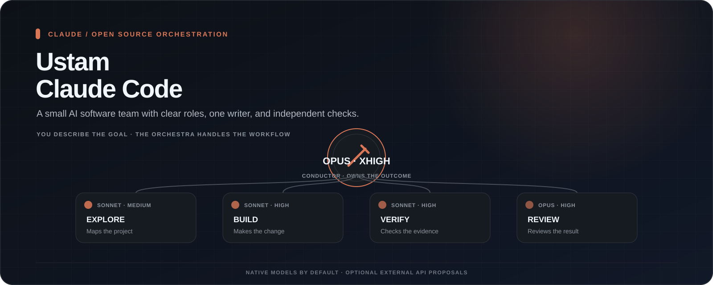
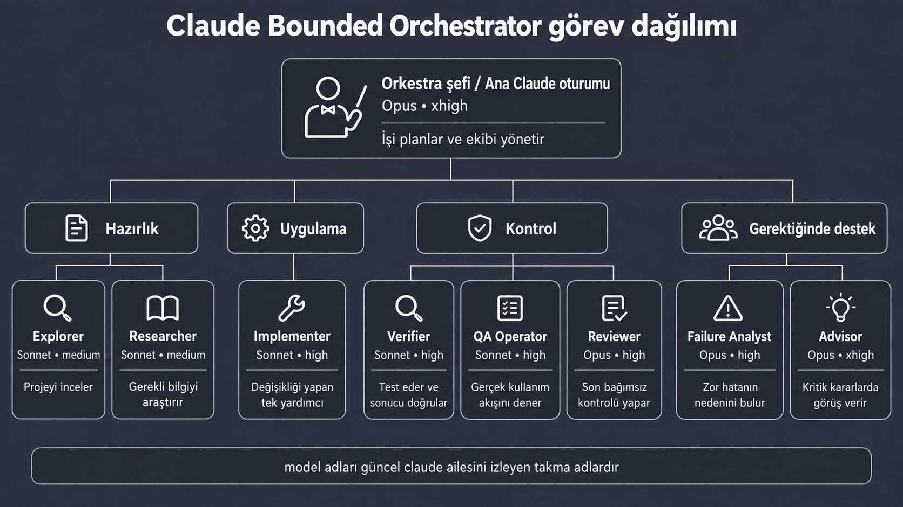
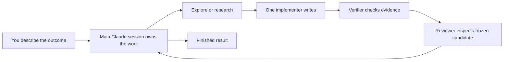

[English](README.md) · [Türkçe](README.tr.md)

<p align="center">
  
</p>

# Claude Bounded Orchestrator

[](LICENSE)
[](https://www.python.org/downloads/)

**A local setup and workflow for Claude Code: one coordinator delegates bounded work to project agents, while a browser console shows planned settings and observed usage.**

Claude Bounded Orchestrator makes the main Claude session a strict coordinator: it speaks with the user, plans and delegates every execution task, even a small one, then reads concise specialist evidence and reports the result. Specialists inspect, research, implement, check and review. One writer owns each scope, and independent verification precedes completion. A private local ledger tracks short task metadata so dependent steps are less likely to be skipped.

You still ask for work in normal language. The project supplies the operating rules behind the scenes.



The visual overview uses short Turkish labels. Version 0.5.0 keeps every native and custom role on Anthropic Claude while adding usage visibility, quota-saving routing, candidate-bound local evaluation, and recoverable task history. OpenAI and DeepSeek remain optional proposal-only APIs.


```mermaid
flowchart LR
    U[You describe the outcome] --> O[Main Claude session owns the work]
    O --> E[Explore or research]
    E --> I[One implementer writes]
    I --> V[Verifier checks evidence]
    V --> R[Reviewer inspects frozen candidate]
    R --> O
    O --> D[Finished result]
```

## What does it do now?

You describe the result in normal language. The main Claude session turns it into bounded tasks, assigns investigation, implementation, verification, and review to separate roles, and keeps one writer responsible for each scope. It records interruptions, user waits, repair routing, and one evidence-backed retry so unfinished work can resume without losing its history.

The browser console offers balanced, quality, economy, quota-saver, and custom profiles; 1–10 real helper slots with a duty, model, effort, and optional short label; and model/token charts from an explicitly supplied Claude Code OpenTelemetry export. Repeating a duty is allowed. Planned slots are distinct from historically observed helpers. If telemetry is unavailable, the console shows no invented usage; Claude Code's `/usage` view remains the source for account usage.

## Why use it?

- **One accountable coordinator:** project instructions direct the main session to speak with you, plan, delegate every execution task, read short evidence, and report the result. It does not inspect, research, implement, test, or review itself; if delegation is unavailable, it reports that limit. This is an instruction policy, not a technical lock on the main session's tools.
- **One writer per scope:** only the implementer receives `Edit` and `Write` tools.
- **Independent checks:** verification and review are separate from implementation.
- **Bounded delegation:** project agents cannot create more agents; native spawn depth is capped at `1`.
- **Finite repair loops:** failed verification or review can trigger a focused repair, not an endless loop.
- **Completion gating:** dependencies and unfinished work remain visible in a lightweight local ledger.
- **Usage visibility:** summarize explicitly supplied OpenTelemetry token/model metrics; otherwise report unavailable and use `/usage`.
- **Optional local evaluation:** run an explicit shell-free project check and require its pass result only when selected.
- **Optional expertise:** UI design and security guidance are available only when explicitly invoked and grant no tools.
- **Safe installation:** existing Claude settings and conflicting managed files are preserved by default.
- **Claude-only native routing:** every prepared and custom role accepts only Claude aliases or full `claude-*` IDs.
- **Guided profiles and team:** choose a profile or configure 1–10 real helper slots, including repeated duties, in the local browser console.
- **Optional external proposals:** local MCP bridges can call OpenAI or DeepSeek without giving either provider workspace access.

## Quick start

Requirements:

- A current [Claude Code installation](https://code.claude.com/docs/en/getting-started)
- Python 3.11 or newer

Clone or download this repository. On macOS, double-click `launchers/Bounded Orchestrator.app`; on Windows, double-click `launchers/Launch Bounded Orchestrator.vbs`. Choose an existing project folder, inspect **Check changes**, and press **Install**. These launchers need Python 3.11+ and the downloaded folder must be kept for later edits. **Close console** stops the local server. They do not install a background service. On macOS, an unnotarized downloaded app may need the command-line fallback below.

Alternatively, preview installation from a terminal:

```bash
python scripts/install.py /path/to/your-project --dry-run
python scripts/install.py /path/to/your-project
```

The same browser console can later **Save** a revised team or **Restore** its preceding console-managed change. It preserves unrelated settings, stops on conflicting owned files, and uses ignored backups. For guided terminal setup on macOS/Linux, run `./setup.command`; on Windows, run `setup.ps1` or double-click `setup.cmd`. The terminal installer keeps external APIs off by default and reviews the final configuration.

The direct installer stays non-interactive and uses `balanced` unless you choose another profile:

```bash
python scripts/install.py /path/to/your-project --preset economy
python scripts/install.py /path/to/your-project --preset quota-saver
python scripts/install.py /path/to/your-project --preset custom \
  --role-model implementer=opus --role-effort implementer=xhigh
```

Native custom values accept `opus`, `sonnet`, `haiku`, `fable`, or a full `claude-*` model ID. GPT, DeepSeek, and other provider IDs are rejected for native roles and must use an explicit proposal-only API provider. The main Claude session accepts `low`, `medium`, `high`, or `xhigh`; child-agent frontmatter additionally accepts `max`.

On Windows PowerShell:

```powershell
.\scripts\install.ps1 -Target C:\path\to\your-project -DryRun
.\scripts\install.ps1 -Target C:\path\to\your-project
```

Open the target project in Claude Code and describe the outcome normally:

```text
Find why checkout sometimes creates duplicate orders, fix it, verify the repair,
and review the final candidate before reporting completion.
```

For a multi-step workflow, Claude can use the local ledger:

```bash
python .claude/tools/task_ledger.py init
python .claude/tools/task_ledger.py add MAP --summary "Map checkout flow" --role explorer
python .claude/tools/task_ledger.py add FIX --summary "Implement approved repair" --role implementer --depends-on MAP
python .claude/tools/task_ledger.py show
```

The ledger is ignored by Git and stores only short metadata. Do not place prompts, source code, logs, command output, credentials, personal data, or secrets in it.

## What gets installed

```text
.claude/
├── agents/                  # bounded project agents and selected orchestra-slot-XX.md helpers
├── skills/                  # opt-in UI and security guidance
├── tools/task_ledger.py     # recoverable metadata-only task tracking
├── tools/usage_report.py    # explicit OpenTelemetry model/token summary
├── tools/local_eval.py      # explicit candidate-bound project check
├── bounded-orchestrator.eval.example.json
├── tools/openai_mcp.py      # installed only when OpenAI is selected
├── tools/deepseek_mcp.py    # installed only when DeepSeek is selected
├── settings.json            # owner model/effort and depth cap on a fresh install
└── .bounded-orchestrator/   # ignored manifest, backups, and ledger state
CLAUDE.md                    # a marked, removable instruction block
.mcp.json                    # added/merged only for an external proposal provider
```

If `.claude/settings.json` already exists, the installer preserves it and writes `bounded-orchestrator.settings.example.json` for manual merging. Merge the `model`, `effortLevel`, and `env` entries you want. Use `--force-settings` only after reviewing the backup plan. Conflicting managed files are also preserved unless `--force` is chosen.

## Optional external proposal provider

Native and custom routing stays Anthropic Claude-only. Guided setup defaults to **None**, or you can explicitly select one external proposal provider:

```bash
# OpenAI GPT
export OPENAI_API_KEY="your key"
python scripts/install.py /path/to/your-project --external-provider openai \
  --external-model gpt-5.6-sol --external-effort high

# DeepSeek V4.1 Flash
export DEEPSEEK_API_KEY="your key"
python scripts/install.py /path/to/your-project --external-provider deepseek \
  --external-model deepseek-flash --external-effort high
```

The [current official DeepSeek V4.1 Flash announcement](https://www.deepseek.com/en/news/deepseek-v4-1-flash/) specifies the `deepseek-flash` alias; API availability still depends on your DeepSeek account and region. DeepSeek effort accepts `low`, `high`, or `max`. OpenAI effort accepts `none`, `low`, `medium`, `high`, `xhigh`, or `max`, subject to the selected model.

API keys must exist in the environment that launches Claude Code. The installer never stores or prints them. It records only provider, model, and effort in MCP configuration, preserves unrelated `.mcp.json` servers, and writes a reviewable example instead of replacing a conflicting entry.

Both bridges use Python's standard library and Claude Code's [local stdio MCP support](https://code.claude.com/docs/en/mcp). The external provider receives only the task, allowed relative paths, constraints, and context explicitly supplied by the owner. It has no filesystem functions and returns untrusted proposal text. The native Claude implementer remains the sole writer and reviews any accepted edit before normal verification and review.

Omitting `--external-provider` on a later non-interactive run preserves an earlier selection. Use `--external-provider none`, `--no-external-openai`, or `--no-external-deepseek` to remove an unchanged installer-owned integration. Modified or unowned entries are kept with a warning. External API calls can incur separate provider charges.

Uninstall unchanged files created by the installer:

```bash
python scripts/install.py /path/to/your-project --uninstall --dry-run
python scripts/install.py /path/to/your-project --uninstall
```

Files changed after installation are kept. The runtime `.gitignore` is also retained so any remaining ledger state or backups stay untracked.

## Roles

| Role | Purpose | Model alias | Effort | Edit/Write |
|---|---|---|---|---:|
| Main Claude session | Coordinates, delegates, reads brief evidence, and reports | `opus` | `xhigh` | No worker actions under the instruction policy; normal session permissions still exist |
| Explorer | Maps code paths and constraints | `sonnet` | `medium` | No |
| Researcher | Verifies current external facts | `sonnet` | `medium` | No |
| Implementer | Makes one assigned change | `sonnet` | `high` | Yes |
| Verifier | Runs focused evidence checks | `sonnet` | `high` | No |
| Failure analyst | Explains one evidenced failure | `opus` | `high` | No |
| QA operator | Observes a bounded runtime flow | `sonnet` | `high` | No |
| Reviewer | Reviews a frozen candidate independently | `opus` | `high` | No |
| Advisor | Advises on one high-risk decision | `opus` | `xhigh` | No |

Aliases select the current Claude family instead of pinning a dated model ID. Model access and supported effort levels depend on your account and current Claude Code client. Environment variables and per-session or per-invocation options can take precedence over project settings; agent frontmatter sets the intended role routing where supported.

## Supported platforms and honest limits

The installer and release builder use the Python 3.11 standard library. Shell launchers are provided for macOS/Linux and PowerShell/cmd launchers for Windows. Repository tests exercise installer, ledger, validation, and release packaging behavior; CI is configured for macOS, Windows, and Ubuntu.

This project does not turn model instructions into a security boundary. The native depth setting and child-agent tool allowlists are concrete Claude Code controls; strict coordinator behavior, role sequence, one-writer discipline, frozen review, and retry limits remain instructions followed by the model. `Bash` can mutate state even when `Edit` and `Write` are unavailable, so verifier and QA instructions restrict it to evidence gathering. Repository, installer, API, and browser checks do not replace a live Claude Code session test. The macOS app and Windows double-click launcher have not been verified by opening them natively on both platforms.

## Documentation

- [Architecture and safety rationale](docs/architecture.md)
- [Examples](docs/examples.md)
- [FAQ and troubleshooting](docs/faq.md)
- [Roadmap](docs/roadmap.md)
- [Runtime smoke test](docs/runtime-smoke-test.md)
- [v0.4.0 release notes](docs/release-v0.4.0.md)
- [Usage reporting and optional local evaluation](docs/usage-and-local-eval.md)
- [v0.5.0 release notes](docs/release-v0.5.0.md)
- [v0.3.1 release notes](docs/release-v0.3.1.md)
- [v0.3.0 release notes](docs/release-v0.3.0.md)
- [v0.2.0 release notes](docs/release-v0.2.0.md)
- [macOS/Linux installation](INSTALL-MACOS.md)
- [Windows installation](INSTALL-WINDOWS.md)
- [Contributing](CONTRIBUTING.md) · [Security](SECURITY.md) · [Changelog](CHANGELOG.md)

## Project status

Version `0.5.0` provides the bounded workflow, local browser setup with a configurable real helper team, opt-in OpenTelemetry usage views, candidate-bound local evaluation, and recoverable task attempts. The orchestra uses distinct characters for known duties; click the conductor to start its animation and click elsewhere to stop. It shows observed token shares, not live activity, context-window fill, or quota remaining. The project adapts [Codex Bounded Orchestrator](https://github.com/metapak/codex-bounded-orchestrator) to Claude Code's native project agents, skills, shared instructions, and settings. See [NOTICE](NOTICE) and [provenance](docs/provenance.md) for attribution.

If the project helps your team, a GitHub star helps other people discover it. Issues and focused pull requests are welcome.

## License

Apache License 2.0. See [LICENSE](LICENSE).

## Local browser console

```sh
python3 scripts/configure.py /path/to/project
```

[Preferences, Usage, and Work console](docs/local-console.md): no npm required; validated preview, explicit Install/Save, restore, and opt-in local OTLP analysis. The planned team and observed usage are labeled separately; missing agent identity or historical effort remains unknown.
