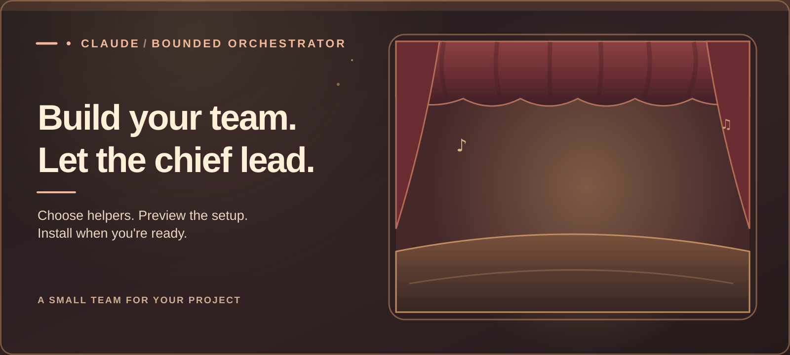
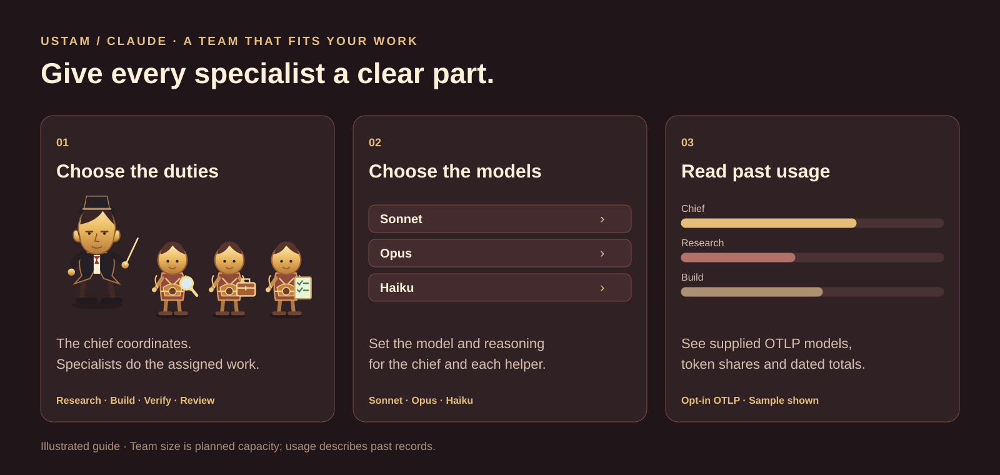
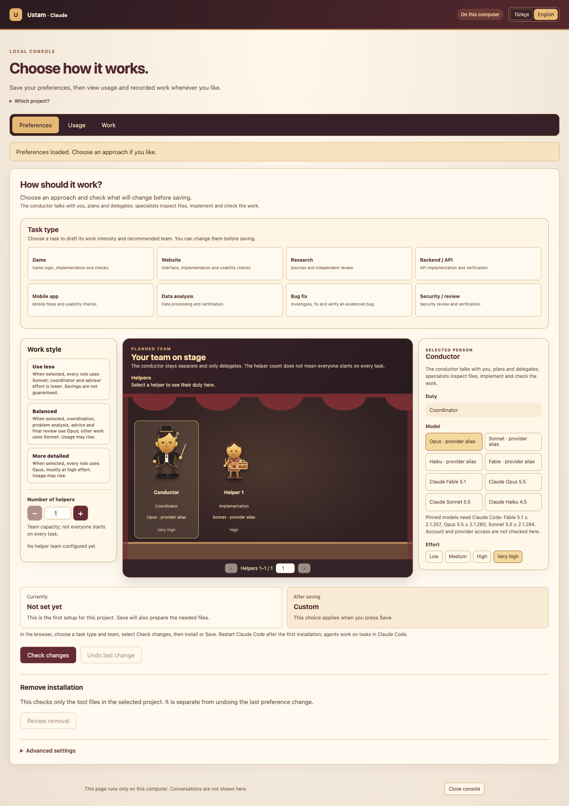
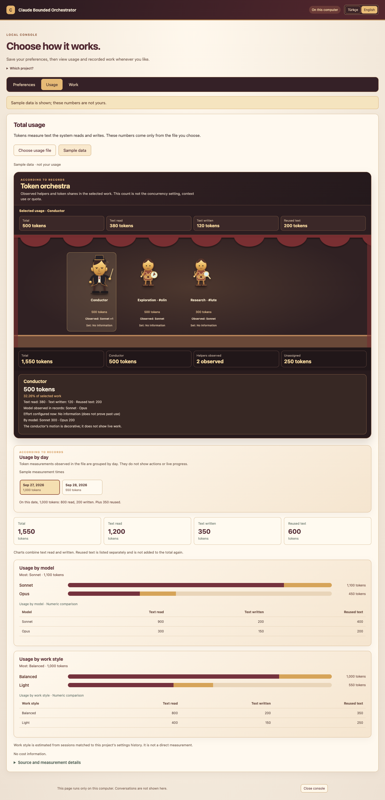

[English](README.md) · [Türkçe](README.tr.md)

<p align="center">
  
</p>

# Claude Bounded Orchestrator

[](LICENSE)
[](https://www.python.org/downloads/)

**Set up a specialist team for Claude Code from a local browser page.**

You still describe the work normally. The main Claude session coordinates and speaks with you; helpers do the assigned work. The browser also shows settings and past usage.



## Install in four steps

Have [Claude Code](https://code.claude.com/docs/en/getting-started) and [Python 3.11 or newer](https://www.python.org/downloads/) installed first. Python is **not included** in this download.

1. **Download:** [Get the current ZIP](https://github.com/metapak/claude-bounded-orchestrator/archive/refs/heads/main.zip) and open the extracted folder.
2. **Open:** On Mac, open `launchers` and double-click **Bounded Orchestrator.app**. On Windows, double-click **Launch Bounded Orchestrator.vbs** in the same folder. On Linux, use the short command below.
3. **Choose a project:** On Mac or Windows, pick the folder where you use Claude Code. On Linux, the command includes that folder instead.
4. **Install:** In the browser, keep the suggested team or change it. Click **Check changes**, then **Install**. Restart Claude Code in that project.

<details>
<summary>Linux: open the same setup page</summary>

Linux has no double-click launcher or folder picker in this package. Open a terminal in the extracted folder, then run this with your project's path:

```bash
python3 scripts/configure.py /absolute/path/to/your-project
```

</details>

To change the team later, open the launcher again (or repeat the Linux command) and use **Save**. It updates the project settings without uninstalling. An already-open Claude Code session may need to be reopened before it uses the changes. If setup does not open, see the [Mac/Linux](INSTALL-MACOS.md) or [Windows](INSTALL-WINDOWS.md) guide.

## Inside the local console

**Preferences — plan your team.** Choose a task draft and work intensity, then set each helper’s duty, Claude model and effort before checking changes.



*Captured from the running Claude console using an empty disposable project. These are unsaved setup choices.*

**Usage — inspect past records.** Import your own explicitly supplied OTLP export, or use the built-in sample to explore the charts and observed orchestra.



*Captured from the running Claude console. Built-in synthetic sample data; no personal usage, live agent activity, or account quota is shown.*

<details>
<summary>Watch the shared 8-second family preview</summary>

<p></p>

Silent, with Turkish titles. This shared-family preview uses sample Codex UI, not a Claude Code recording or live data. [Download the original MP4](https://raw.githubusercontent.com/metapak/claude-bounded-orchestrator/main/docs/assets/bounded-orchestrator-intro-8s.mp4).

</details>

Linux uses the short command above for the same browser page; it has no double-click launcher here. The [macOS/Linux guide](INSTALL-MACOS.md) and [Windows guide](INSTALL-WINDOWS.md) cover opening problems and manual setup. Native double-click launch and a live Claude Code session have not been verified by repository tests.

<details>
<summary>Optional terminal and manual setup</summary>

From the extracted repository, preview and install with the non-interactive installer:

```bash
python3 scripts/install.py /path/to/your-project --dry-run
python3 scripts/install.py /path/to/your-project
```

The default profile is `balanced`. Other examples:

```bash
python3 scripts/install.py /path/to/your-project --preset economy
python3 scripts/install.py /path/to/your-project --preset quota-saver
python3 scripts/install.py /path/to/your-project --preset custom \
  --role-model implementer=opus --role-effort implementer=xhigh
```

Native custom values accept `opus`, `sonnet`, `haiku`, `fable`, or a full `claude-*` model ID. The main session accepts efforts `low`, `medium`, `high`, or `xhigh`; child agents additionally accept `max`. For a guided terminal installer, use `./setup.command` on macOS/Linux or `setup.ps1`/`setup.cmd` on Windows. Windows PowerShell can also run:

```powershell
.\scripts\install.ps1 -Target C:\path\to\your-project -DryRun
.\scripts\install.ps1 -Target C:\path\to\your-project
```

The optional metadata-only ledger is documented in the [examples](docs/examples.md). Do not put prompts, source, logs, credentials, or personal data in it.

</details>

## What does it do now?

You describe the result in normal language. The main Claude session turns it into bounded tasks, assigns investigation, implementation, verification, and review to separate roles, and keeps one writer responsible for each scope. It records interruptions, user waits, repair routing, and one evidence-backed retry so unfinished work can resume without losing its history.

The browser console offers eight task drafts (games, websites, research, backend/API, mobile apps, data analysis, bug fixes, security/review). Each task selects a recommended work intensity and team in an unsaved draft; you can override the choices before saving. You can save 1–50 real helper slots, each with a duty, model, effort, and optional short label, and view model/token charts from an explicitly supplied Claude Code OpenTelemetry export. Repeating a duty is allowed. Planned slots are distinct from historically observed helpers. If telemetry is unavailable, the console shows no invented usage; Claude Code's `/usage` view remains the source for account usage.

## Why use it?

- **One accountable coordinator:** project instructions direct the main session to speak with you, plan, delegate every execution task, read short evidence, and report the result. It does not inspect, research, implement, test, or review itself; if delegation is unavailable, it reports that limit. This is an instruction policy, not a technical lock on the main session's tools.
- **One writer per scope:** only the implementer receives `Edit` and `Write` tools.
- **Independent checks:** verification and review are separate from implementation.
- **Bounded delegation:** project agents cannot create more agents; native spawn depth is capped at `1`.
- **Finite repair loops:** failed verification or review can trigger a focused repair, not an endless loop.
- **Completion gating:** dependencies and unfinished work remain visible in a lightweight local ledger.
- **Usage visibility:** summarize explicitly supplied OpenTelemetry token/model metrics; otherwise report unavailable and use `/usage`.
- **Optional local evaluation:** run an explicit shell-free project check and require its pass result only when selected.
- **Optional expertise:** UI design and security guidance are available only when explicitly invoked and grant no tools.
- **Safe installation:** existing Claude settings and conflicting managed files are preserved by default.
- **Claude-only native routing:** every prepared and custom role accepts only Claude aliases or full `claude-*` IDs.
- **Guided task drafts and team:** choose a task with its recommended work intensity, adjust it, undo an unsaved draft, or configure 1–50 real helper slots, including repeated duties, in the local browser console.
- **Optional external proposals:** local MCP bridges can call OpenAI or DeepSeek without giving either provider workspace access.

## What gets installed

```text
.claude/
├── agents/                  # bounded project agents and selected orchestra-slot-XX.md helpers
├── skills/                  # opt-in UI and security guidance
├── tools/task_ledger.py     # recoverable metadata-only task tracking
├── tools/usage_report.py    # explicit OpenTelemetry model/token summary
├── tools/local_eval.py      # explicit candidate-bound project check
├── bounded-orchestrator.eval.example.json
├── tools/openai_mcp.py      # installed only when OpenAI is selected
├── tools/deepseek_mcp.py    # installed only when DeepSeek is selected
├── settings.json            # owner model/effort and depth cap on a fresh install
└── .bounded-orchestrator/   # ignored manifest, backups, and ledger state
CLAUDE.md                    # a marked, removable instruction block
.mcp.json                    # added/merged only for an external proposal provider
```

If `.claude/settings.json` already exists, the installer preserves it and writes `bounded-orchestrator.settings.example.json` for manual merging. Merge the `model`, `effortLevel`, and `env` entries you want. Use `--force-settings` only after reviewing the backup plan. Conflicting managed files are also preserved unless `--force` is chosen.

## Optional external proposal provider

Native and custom routing stays Anthropic Claude-only. Guided setup defaults to **None**, or you can explicitly select one external proposal provider:

```bash
# OpenAI GPT
export OPENAI_API_KEY="your key"
python scripts/install.py /path/to/your-project --external-provider openai \
  --external-model gpt-5.6-sol --external-effort high

# DeepSeek V4.1 Flash
export DEEPSEEK_API_KEY="your key"
python scripts/install.py /path/to/your-project --external-provider deepseek \
  --external-model deepseek-flash --external-effort high
```

The [current official DeepSeek V4.1 Flash announcement](https://www.deepseek.com/en/news/deepseek-v4-1-flash/) specifies the `deepseek-flash` alias; API availability still depends on your DeepSeek account and region. DeepSeek effort accepts `low`, `high`, or `max`. OpenAI effort accepts `none`, `low`, `medium`, `high`, `xhigh`, or `max`, subject to the selected model.

API keys must exist in the environment that launches Claude Code. The installer never stores or prints them. It records only provider, model, and effort in MCP configuration, preserves unrelated `.mcp.json` servers, and writes a reviewable example instead of replacing a conflicting entry.

Both bridges use Python's standard library and Claude Code's [local stdio MCP support](https://code.claude.com/docs/en/mcp). The external provider receives only the task, allowed relative paths, constraints, and context explicitly supplied by the owner. It has no filesystem functions and returns untrusted proposal text. The native Claude implementer remains the sole writer and reviews any accepted edit before normal verification and review.

Omitting `--external-provider` on a later non-interactive run preserves an earlier selection. Use `--external-provider none`, `--no-external-openai`, or `--no-external-deepseek` to remove an unchanged installer-owned integration. Modified or unowned entries are kept with a warning. External API calls can incur separate provider charges.

On macOS and Linux, uninstall unchanged files created by the installer:

```bash
python scripts/install.py /path/to/your-project --uninstall --dry-run
python scripts/install.py /path/to/your-project --uninstall
```

Files changed after installation are kept. The runtime `.gitignore` is also retained so any remaining ledger state or backups stay untracked.
On Windows, both `--uninstall` and `--uninstall --dry-run` stop without changing files because the required secure removal operations are unavailable. Use the conservative [Windows manual cleanup steps](INSTALL-WINDOWS.md); they leave `CLAUDE.md` and MCP configuration for separate review.

## Roles

| Role | Purpose | Model alias | Effort | Edit/Write |
|---|---|---|---|---:|
| Main Claude session | Coordinates, delegates, reads brief evidence, and reports | `opus` | `xhigh` | No worker actions under the instruction policy; normal session permissions still exist |
| Explorer | Maps code paths and constraints | `sonnet` | `medium` | No |
| Researcher | Verifies current external facts | `sonnet` | `medium` | No |
| Implementer | Makes one assigned change | `sonnet` | `high` | Yes |
| Verifier | Runs focused evidence checks | `sonnet` | `high` | No |
| Failure analyst | Explains one evidenced failure | `opus` | `high` | No |
| QA operator | Observes a bounded runtime flow | `sonnet` | `high` | No |
| Reviewer | Reviews a frozen candidate independently | `opus` | `high` | No |
| Advisor | Advises on one high-risk decision | `opus` | `xhigh` | No |

Aliases select the current Claude family instead of pinning a dated model ID. Model access and supported effort levels depend on your account and current Claude Code client. Environment variables and per-session or per-invocation options can take precedence over project settings; agent frontmatter sets the intended role routing where supported.

## Supported platforms and honest limits

The installer and release builder use the Python 3.11 standard library. Shell launchers are provided for macOS/Linux and PowerShell/cmd launchers for Windows. Repository tests exercise installer, ledger, validation, and release packaging behavior; CI is configured for macOS, Windows, and Ubuntu.

This project does not turn model instructions into a security boundary. The native depth setting and child-agent tool allowlists are concrete Claude Code controls; strict coordinator behavior, role sequence, one-writer discipline, frozen review, and retry limits remain instructions followed by the model. `Bash` can mutate state even when `Edit` and `Write` are unavailable, so verifier and QA instructions restrict it to evidence gathering. Repository, installer, API, and browser checks do not replace a live Claude Code session test. The macOS app and Windows double-click launcher have not been verified by opening them natively on both platforms.

## Documentation

- [Architecture and safety rationale](docs/architecture.md)
- [Examples](docs/examples.md)
- [FAQ and troubleshooting](docs/faq.md)
- [Roadmap](docs/roadmap.md)
- [Runtime smoke test](docs/runtime-smoke-test.md)
- [v0.4.0 release notes](docs/release-v0.4.0.md)
- [Usage reporting and optional local evaluation](docs/usage-and-local-eval.md)
- [v0.5.0 release notes](docs/release-v0.5.0.md)
- [v0.3.1 release notes](docs/release-v0.3.1.md)
- [v0.3.0 release notes](docs/release-v0.3.0.md)
- [v0.2.0 release notes](docs/release-v0.2.0.md)
- [macOS/Linux installation](INSTALL-MACOS.md)
- [Windows installation](INSTALL-WINDOWS.md)
- [Contributing](CONTRIBUTING.md) · [Security](SECURITY.md) · [Changelog](CHANGELOG.md)

## Project status

Version `0.5.0` provides the bounded workflow, local browser setup with a configurable real helper team, opt-in OpenTelemetry usage views, candidate-bound local evaluation, and recoverable task attempts. The orchestra uses distinct characters for known duties; the conductor animates decoratively and continuously, including when the system prefers reduced motion. It shows observed token shares, not live activity, context-window fill, or quota remaining. The project adapts [Codex Bounded Orchestrator](https://github.com/metapak/codex-bounded-orchestrator) to Claude Code's native project agents, skills, shared instructions, and settings. See [NOTICE](NOTICE) and [provenance](docs/provenance.md) for attribution.

If the project helps your team, a GitHub star helps other people discover it. Issues and focused pull requests are welcome.

## License

Apache License 2.0. See [LICENSE](LICENSE).

## Local browser console

```sh
python3 scripts/configure.py /path/to/project
```

[Preferences, Usage, and Work console](docs/local-console.md): no npm required; validated preview, explicit Install/Save, restore, and opt-in local OTLP analysis. The planned team and observed usage are labeled separately; missing agent identity or historical effort remains unknown.
