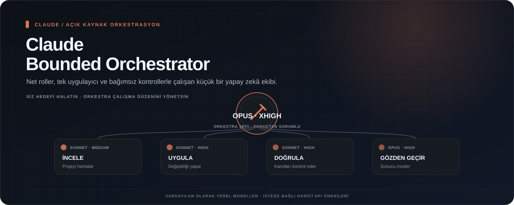
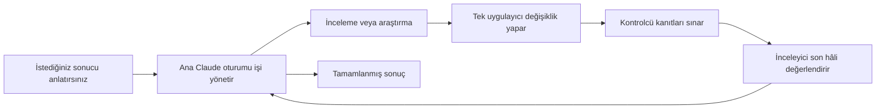

[English](README.md) · [Türkçe](README.tr.md)

<p align="center">
  
</p>

# Claude Bounded Orchestrator

[](LICENSE)
[](https://www.python.org/downloads/)

**Karmaşık Claude Code işleri için küçük, düzenli ve kontrol edilebilir bir ekip yapısı.**

Claude Bounded Orchestrator, ana Claude oturumuna işin sorumluluğunu verir. İnceleme, uygulama ve kontrol aşamalarını birbirinden ayırır; aynı alanda yalnızca bir yardımcının değişiklik yapmasını sağlar. Küçük ve yerel bir görev listesi de birbirine bağlı adımların unutulmasını azaltır.

Siz ne istediğinizi normal şekilde yazmaya devam edersiniz. Proje, arka plandaki çalışma düzenini sağlar.


Görsel, ana Claude oturumunun işi yardımcılara nasıl dağıttığını özetler. 0.4.0 sürümünde yerel ve özel roller yalnızca Anthropic Claude modelleriyle çalışır; OpenAI veya DeepSeek ise ancak açıkça seçilen, sadece öneri üreten haricî API olarak eklenir. Kurulum ekranı bütün sistemlerde daha anlaşılırdır.



## Ne kazandırır?

- Ana Claude oturumu kapsamı, kararları ve sonucu sahiplenir.
- Yalnızca uygulayıcıya dosya değiştirme araçları verilir.
- Değişikliği yapan ile kontrol eden birbirinden ayrılır.
- Yardımcılar yeni yardımcı oluşturamaz; yerleşik derinlik sınırı `1` olur.
- Düzeltme döngüleri sınırlıdır, aynı başarısız yöntem durmadan tekrarlanmaz.
- Hafif görev listesi bekleyen, engellenen ve tamamlanan adımları görünür tutar.
- Tasarım ve güvenlik uzmanlığı yalnızca açıkça istendiğinde kullanılır ve yeni yetki vermez.
- Kurulum mevcut Claude ayarlarını ve çakışan dosyaları varsayılan olarak korur.
- Dengeli, yüksek kalite, ekonomik veya Claude rollerini tek tek ayarlayabileceğiniz özel profil seçilebilir.
- Yerel ve özel roller yalnızca Claude kısa adlarını veya tam `claude-*` kimliklerini kabul eder.
- İstenirse OpenAI GPT veya DeepSeek yalnızca yama önerisi üretmek için haricî API olarak eklenebilir.

## Hızlı başlangıç

Gerekenler:

- Güncel bir [Claude Code kurulumu](https://code.claude.com/docs/en/getting-started)
- Python 3.11 veya daha yeni bir sürüm

Bu depoyu indirdikten sonra kendi projenizde kurulumu önce önizleyin:

```bash
python scripts/install.py /projenizin/yolu --dry-run
python scripts/install.py /projenizin/yolu
```

Yönlendirmeli kurulum için macOS/Linux'ta `./setup.command` çalıştırın. Windows'ta `setup.ps1` çalıştırabilir veya `setup.cmd` dosyasına çift tıklayabilirsiniz. Yeni ekran hedef klasörü ve işlemi sorar, her profil için kısa açıklama gösterir, haricî API'leri varsayılan olarak kapalı tutar, son ayar özetini ve sonraki adımları gösterir.

Doğrudan kurucu komutu seçim ekranı açmaz ve varsayılan olarak dengeli profili kullanır:

```bash
python scripts/install.py /projenizin/yolu --preset economy
python scripts/install.py /projenizin/yolu --preset custom \
  --role-model implementer=opus --role-effort implementer=xhigh
```

Yerel özel model olarak yalnızca `opus`, `sonnet`, `haiku` veya tam bir `claude-*` kimliği kullanılabilir. GPT, DeepSeek ve diğer marka kimlikleri yerel roller için reddedilir; bunlar açıkça seçilen haricî öneri API’si üzerinden kullanılmalıdır. Ana Claude oturumu için düşünme düzeyi `low`, `medium`, `high` veya `xhigh` olabilir; yardımcıların ön yüz ayarlarında ayrıca `max` kullanılabilir.

Windows PowerShell için:

```powershell
.\scripts\install.ps1 -Target C:\projenizin\yolu -DryRun
.\scripts\install.ps1 -Target C:\projenizin\yolu
```

Hedef projeyi Claude Code ile açın ve isteğinizi normal şekilde yazın:

```text
Ödeme sırasında bazen neden iki sipariş oluştuğunu bul, sorunu düzelt,
sonucu kontrol et ve tamamlamadan önce son hâli ayrıca incelet.
```

Uzun işlerde yerel görev listesi kullanılabilir:

```bash
python .claude/tools/task_ledger.py init
python .claude/tools/task_ledger.py add INCELE --summary "Ödeme akışını incele" --role explorer
python .claude/tools/task_ledger.py add DUZELT --summary "Onaylanan düzeltmeyi uygula" --role implementer --depends-on INCELE
python .claude/tools/task_ledger.py show
```

Bu liste Git'e eklenmez ve yalnızca kısa durum bilgileri tutar. Kullanıcı istemleri, kaynak kodu, günlükler, komut çıktıları, şifreler, kişisel bilgiler veya gizli anahtarlar bu listeye yazılmamalıdır.

## Kurulan yapı

```text
.claude/
├── agents/                  # görevleri sınırlı yardımcılar
├── skills/                  # isteğe bağlı tasarım ve güvenlik rehberleri
├── tools/task_ledger.py     # kısa görev takibi
├── tools/openai_mcp.py      # yalnızca OpenAI seçilirse kurulur
├── tools/deepseek_mcp.py    # yalnızca DeepSeek seçilirse kurulur
├── settings.json            # yeni kurulumda ana model, düşünme düzeyi ve derinlik sınırı
└── .bounded-orchestrator/   # Git dışı kayıt, yedek ve görev durumu
CLAUDE.md                    # işaretli ve kaldırılabilir talimat bölümü
.mcp.json                    # yalnızca haricî öneri sağlayıcısı seçilirse eklenir/birleştirilir
```

Projede `.claude/settings.json` zaten varsa kurulum bu dosyayı değiştirmez; elle birleştirmeniz için `bounded-orchestrator.settings.example.json` oluşturur. İstediğiniz `model`, `effortLevel` ve `env` alanlarını inceleyerek birleştirebilirsiniz. Çakışan dosyalar da `--force` seçilmedikçe korunur.

## İsteğe bağlı haricî öneri sağlayıcısı

Yerel ve özel görev dağılımı yalnızca Anthropic Claude modelleriyle çalışır. Kurulum ekranında varsayılan seçim **Yok** olur. İsterseniz tek bir haricî öneri sağlayıcısını açıkça seçebilirsiniz:

```bash
# OpenAI GPT
export OPENAI_API_KEY="anahtarınız"
python scripts/install.py /projenizin/yolu --external-provider openai \
  --external-model gpt-5.6-sol --external-effort high

# DeepSeek V4.1 Flash
export DEEPSEEK_API_KEY="anahtarınız"
python scripts/install.py /projenizin/yolu --external-provider deepseek \
  --external-model deepseek-flash --external-effort high
```

[Güncel resmî DeepSeek V4.1 Flash duyurusuna](https://www.deepseek.com/en/news/deepseek-v4-1-flash/) göre API kısa adı `deepseek-flash`tır; erişim hesabınıza ve bölgenize bağlıdır. DeepSeek düşünme düzeyi `low`, `high` veya `max` olabilir. OpenAI için `none`, `low`, `medium`, `high`, `xhigh` veya `max` seçilebilir; gerçek destek modele bağlıdır.

API anahtarı Claude Code'u başlattığınız ortamda tanımlanır. Kurucu anahtarı kaydetmez veya ekrana yazmaz; MCP ayarına yalnızca sağlayıcı, model ve düşünme düzeyi eklenir. Var olan `.mcp.json` sunucuları korunur. Çakışan bir girdi değiştirilmez ve elle inceleme için örnek dosya yazılır.

Her iki köprü de Python standart kütüphanesini ve Claude Code'un [yerel MCP desteğini](https://code.claude.com/docs/en/mcp) kullanır. Haricî sağlayıcı yalnızca ana yöneticinin açıkça verdiği görev, izinli yollar, kurallar ve seçilmiş bağlamı görür. Çalışma alanını okuyamaz veya değiştiremez; güvenilmeyen bir öneri döndürür. Yerel Claude uygulayıcısı tek dosya yazarı olarak kalır, kabul edilen öneriyi uygular ve normal kontrol süreci devam eder.

Sonraki komutlu kurulumda `--external-provider` yazılmazsa önceki seçim korunur. Kurucuya ait değişmemiş bağlantıyı kaldırmak için `--external-provider none`, `--no-external-openai` veya `--no-external-deepseek` kullanılabilir. Değiştirilmiş veya başkasına ait girdiler uyarıyla korunur. Haricî API kullanımı ayrıca ücret oluşturabilir.

Kaldırma işlemini önce önizleyebilirsiniz:

```bash
python scripts/install.py /projenizin/yolu --uninstall --dry-run
python scripts/install.py /projenizin/yolu --uninstall
```

Kurulumdan sonra değiştirilmiş dosyalar silinmez. Kalan görev durumu ve yedeklerin Git'e eklenmemesi için çalışma klasöründeki `.gitignore` dosyası da korunur.

## Roller

| Rol | Görevi | Model ailesi | Düşünme düzeyi | Dosya değiştirme |
|---|---|---|---|---:|
| Ana Claude oturumu | Kapsamı, kararları ve sonucu yönetir | `opus` | `xhigh` | Oturumun normal izinlerine bağlıdır |
| İnceleyici | Projedeki yolları ve sınırları bulur | `sonnet` | `medium` | Hayır |
| Araştırmacı | Güncel dış bilgileri doğrular | `sonnet` | `medium` | Hayır |
| Uygulayıcı | Kendisine verilen değişikliği yapar | `sonnet` | `high` | Evet |
| Kontrolcü | Sonucu kanıtlarla sınar | `sonnet` | `high` | Hayır |
| Hata çözümleyici | Kanıtlanmış bir hatanın nedenini açıklar | `opus` | `high` | Hayır |
| Kullanım kontrolcüsü | Sınırlı bir kullanım akışını gözlemler | `sonnet` | `high` | Hayır |
| Son inceleyici | Değişmeyen son hâli bağımsız inceler | `opus` | `high` | Hayır |
| Danışman | Riskli tek bir karar için görüş verir | `opus` | `xhigh` | Hayır |

Bu adlar tarihli bir model sürümünü sabitlemek yerine güncel Claude ailesini seçen kısa adlardır. Model erişimi ve desteklenen düşünme düzeyleri hesabınıza ve güncel Claude Code istemcinize bağlıdır. Ortam değişkenleri ile oturum veya çalıştırma sırasında verilen seçenekler proje ayarlarının önüne geçebilir; yardımcı dosyalarındaki ayarlar desteklendiği yerde hedeflenen rol dağılımını uygular.

## Desteklenen sistemler ve sınırlar

Kurulum ve paket oluşturma araçları Python 3.11 standart kütüphanesini kullanır. macOS/Linux için kabuk dosyaları, Windows için PowerShell ve cmd dosyaları bulunur. Otomatik kontroller macOS, Windows ve Ubuntu üzerinde kurulum, görev listesi ve paketleme davranışını sınayacak şekilde hazırlanmıştır.

Talimatlar tek başına kesin bir güvenlik sınırı değildir. Yardımcı derinliği ve araç listeleri Claude Code'un somut kontrolleridir; rol sırası, tek uygulayıcı kuralı, son hâli sabitleme ve sınırlı tekrar kuralları ise modelin izlemesi gereken talimatlardır. `Bash`, `Edit` ve `Write` olmasa bile değişiklik yapabilir; bu nedenle kontrol rollerine yalnızca kanıt toplamak için kullanma talimatı verilir. Kendi güncel Claude Code sürümünüzle canlı deneme yapmanız gerekir.

## Belgeler

- [Mimari ve güvenlik gerekçesi](docs/architecture.md)
- [Kullanım örnekleri](docs/examples.md)
- [Sık sorulan sorular ve sorun giderme](docs/faq.md)
- [Yol haritası](docs/roadmap.md)
- [Canlı deneme rehberi](docs/runtime-smoke-test.md)
- [v0.4.0 sürüm notları](docs/release-v0.4.0.tr.md)
- [v0.3.1 sürüm notları](docs/release-v0.3.1.tr.md)
- [v0.3.0 sürüm notları](docs/release-v0.3.0.tr.md)
- [v0.2.0 sürüm notları](docs/release-v0.2.0.tr.md)
- [macOS/Linux kurulumu](INSTALL-MACOS.md)
- [Windows kurulumu](INSTALL-WINDOWS.md)
- [Katkı rehberi](CONTRIBUTING.md) · [Güvenlik](SECURITY.md) · [Değişiklikler](CHANGELOG.md)

## Projenin durumu

`0.4.0`, Claude’a ait yerel görev dağılımını marka dışı model kimliklerinden korur, isteğe bağlı OpenAI veya DeepSeek öneri sağlayıcısı ekler ve macOS, Linux ile Windows kurulum ekranını yeniler. Proje, [Codex Bounded Orchestrator](https://github.com/metapak/codex-bounded-orchestrator) çalışma düzenini Claude Code'un proje yardımcılarına, becerilerine, ortak talimatlarına ve ayarlarına uyarlar. Atıflar için [NOTICE](NOTICE) ve [kaynak bilgisi](docs/provenance.md) belgelerine bakabilirsiniz.

Proje işinize yararsa vereceğiniz bir GitHub yıldızı daha fazla kişinin projeyi bulmasına yardımcı olur. Hata bildirimleri ve odaklı katkılar memnuniyetle karşılanır.

## Lisans

Apache License 2.0. Ayrıntılar için [LICENSE](LICENSE).
