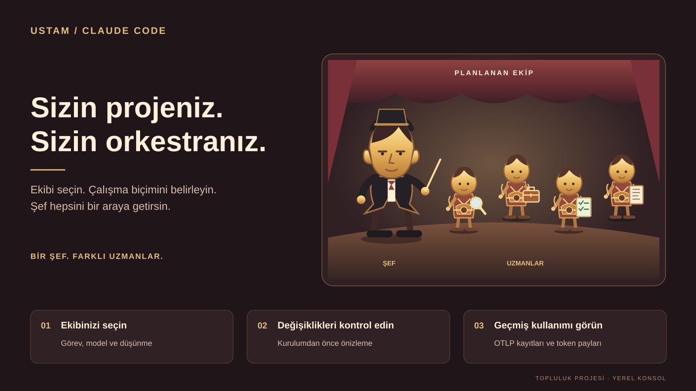
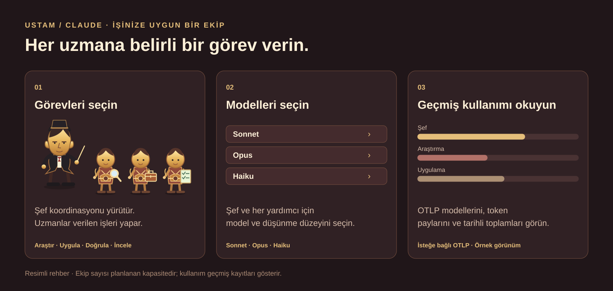
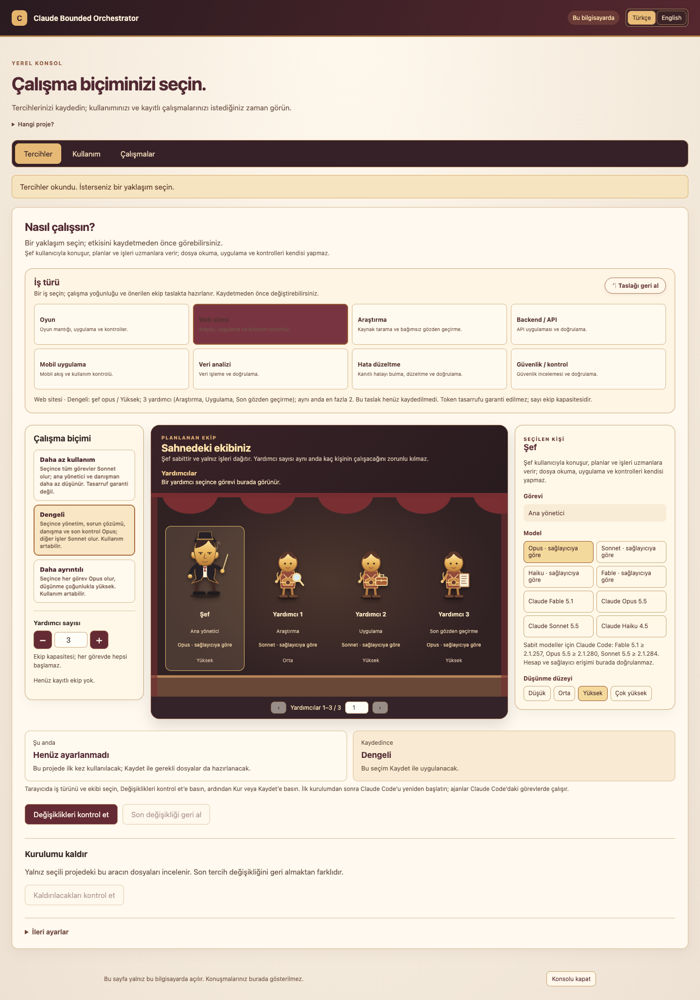
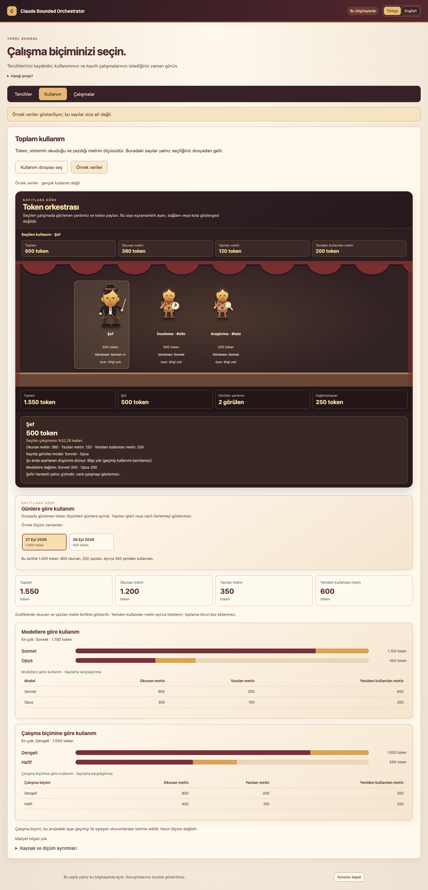

[English](README.md) · [Türkçe](README.tr.md)

<p align="center">
  
</p>

# Claude Bounded Orchestrator

[](LICENSE)
[](https://www.python.org/downloads/)

**Claude Code için uzman ekibini yerel tarayıcı sayfasından kurun.**

İsteğinizi yine normal şekilde anlatırsınız. Ana Claude oturumu sizinle konuşur ve işleri düzenler; verilen işleri yardımcılar yapar. Tarayıcıda ayarları ve geçmiş kullanımı da görürsünüz.



## Dört adımda kurulum

Önce [Claude Code](https://code.claude.com/docs/en/getting-started) ve [Python 3.11 veya yenisi](https://www.python.org/downloads/) kurulu olsun. Python bu indirmeye **dahil değildir**.

1. **İndirin:** [Güncel ZIP dosyasını alın](https://github.com/metapak/claude-bounded-orchestrator/archive/refs/heads/main.zip) ve açılan klasöre girin.
2. **Açın:** Mac'te `launchers` klasöründeki **Bounded Orchestrator.app** dosyasına çift tıklayın. Windows'ta aynı klasördeki **Launch Bounded Orchestrator.vbs** dosyasına çift tıklayın. Linux'ta aşağıdaki kısa komutu kullanın.
3. **Proje seçin:** Mac veya Windows'ta Claude Code kullandığınız klasörü seçin. Linux'ta bu klasörü komutta belirtirsiniz.
4. **Kurun:** Tarayıcıda önerilen ekibi bırakabilir veya değiştirebilirsiniz. **Değişiklikleri kontrol et**, ardından **Kur** düğmesine basın. Claude Code'u bu projede yeniden başlatın.

<details>
<summary>Linux: aynı kurulum ekranını açın</summary>

Bu pakette Linux için çift tıklamalı başlatıcı veya klasör seçici yoktur. Açtığınız klasörde terminal açın ve projenizin yoluyla şu komutu çalıştırın:

```bash
python3 scripts/configure.py /projenizin/tam/yolu
```

</details>

Ekibi daha sonra değiştirmek için başlatıcıyı yeniden açıp (Linux'ta komutu yineleyip) **Kaydet** düğmesini kullanın. Ayarlar projeye hemen yazılır; silip yeniden kurmanız gerekmez. Açık Claude Code oturumunun yeni ayarları kullanması için oturumu yeniden açmanız gerekebilir. Kurulum açılmazsa [Mac/Linux](INSTALL-MACOS.md) veya [Windows](INSTALL-WINDOWS.md) rehberine bakın.

## Yerel konsolun içinde

**Tercihler — ekibinizi planlayın.** Bir iş taslağı ve çalışma yoğunluğu seçin; değişiklikleri kontrol etmeden önce her yardımcının görevini, Claude modelini ve düşünme düzeyini ayarlayın.



*Çalışan Claude konsolundan, boş bir geçici projede alındı. Bunlar henüz kaydedilmemiş kurulum seçimleridir.*

**Kullanım — geçmiş kayıtları inceleyin.** Açıkça sağladığınız OTLP dosyasını yükleyin veya grafik ve gözlemlenen orkestrayı incelemek için yerleşik örneği açın.



*Çalışan Claude konsolundan alındı. Yerleşik sentetik örnek veridir; kişisel kullanım, canlı ajan etkinliği veya hesap kotası göstermez.*

<details>
<summary>Ortak ailenin 8 saniyelik önizlemesini izleyin</summary>

<p></p>

Sessizdir; Türkçe başlıklar içerir. Ortak aile tanıtımında örnek Codex ekranı vardır; Claude Code kaydı veya canlı veri değildir. [Orijinal MP4 dosyasını indirin](https://raw.githubusercontent.com/metapak/claude-bounded-orchestrator/main/docs/assets/bounded-orchestrator-intro-8s.mp4).

</details>

Linux'ta aynı tarayıcı sayfası yukarıdaki kısa komutla açılır; bu pakette çift tıklamalı Linux başlatıcısı yoktur. Açılış sorunları ve elle kurulum için [macOS/Linux rehberine](INSTALL-MACOS.md) veya [Windows rehberine](INSTALL-WINDOWS.md) bakın. Depo testleri çift tıklamayla açılışı ve canlı Claude Code oturumunu doğrulamaz.

<details>
<summary>İsteğe bağlı terminal ve elle kurulum</summary>

Çıkarılan depo klasöründen önizleyip kurabilirsiniz:

```bash
python3 scripts/install.py /projenizin/yolu --dry-run
python3 scripts/install.py /projenizin/yolu
```

Varsayılan profil `balanced` olur. Diğer örnekler:

```bash
python3 scripts/install.py /projenizin/yolu --preset economy
python3 scripts/install.py /projenizin/yolu --preset quota-saver
python3 scripts/install.py /projenizin/yolu --preset custom \
  --role-model implementer=opus --role-effort implementer=xhigh
```

Yerel modeller `opus`, `sonnet`, `haiku`, `fable` veya tam `claude-*` kimliğidir. Ana oturumda `low`, `medium`, `high`, `xhigh`; yardımcı dosyalarında ayrıca `max` düşünme düzeyi kullanılabilir. Komutlu yönlendirme için macOS/Linux’ta `./setup.command`, Windows’ta `setup.ps1` veya `setup.cmd` vardır. Windows PowerShell seçeneği:

```powershell
.\scripts\install.ps1 -Target C:\projenizin\yolu -DryRun
.\scripts\install.ps1 -Target C:\projenizin\yolu
```

İsteğe bağlı, yalnız kısa bilgiler tutan görev listesi [örneklerde](docs/examples.md) anlatılır. Bu listeye istem, kaynak, günlük, anahtar veya kişisel bilgi koymayın.

</details>

## Artık ne yapıyor?

Siz istediğiniz sonucu normal şekilde anlatırsınız. Ana Claude oturumu işi sınırlı görevlere ayırır; inceleme, uygulama, doğrulama ve son değerlendirmeyi ayrı rollere verir ve her kapsamta tek bir uygulayıcıyı sorumlu tutar. Kesintiler, kullanıcıdan yanıt bekleyen işler, onarımın kime döneceği ve kanıta dayalı tek yeniden deneme kaydedilir. Böylece yarım kalan çalışma geçmişi kaybolmadan devam ettirilebilir.

Tarayıcı konsolunda on iş türü taslağı (görsel, oyun, web sitesi, araştırma, backend/API, mobil, veri, hata, güvenlik, belge) ile dengeli, yüksek kalite, ekonomik, kota tasarrufu ve özel çalışma yoğunluğu ayrı seçilir; 1–50 gerçek yardımcı slotu bulunur. Her slotun görevi, Claude modeli, düşünme düzeyi ve isteğe bağlı kısa etiketi seçilebilir; aynı görev tekrar edebilir. Planlanan ekip, geçmiş kullanımda gözlenen yardımcı sayısı değildir. Model ve token raporu yalnız açıkça verilen Claude Code OpenTelemetry dosyasını özetler; dosya yoksa sayı uydurmaz. Hesap kullanımı için Claude Code içindeki `/usage` ekranına bakın.

## Ne kazandırır?

- Ana Claude oturumu kullanıcıyla konuşur, planlar, işleri devreder, kısa uzman raporlarını okur ve sonucu bildirir; yürütme işini üstlenmez. Bu kural teknik araç kilidi değil, model talimatıdır.
- Yalnızca uygulayıcıya dosya değiştirme araçları verilir.
- Değişikliği yapan ile kontrol eden birbirinden ayrılır.
- Yardımcılar yeni yardımcı oluşturamaz; yerleşik derinlik sınırı `1` olur.
- Düzeltme döngüleri sınırlıdır, aynı başarısız yöntem durmadan tekrarlanmaz.
- Hafif görev listesi bekleyen, engellenen ve tamamlanan adımları görünür tutar.
- Tasarım ve güvenlik uzmanlığı yalnızca açıkça istendiğinde kullanılır ve yeni yetki vermez.
- Kurulum mevcut Claude ayarlarını ve çakışan dosyaları varsayılan olarak korur.
- Yerel konsolda iş türü taslağı ve çalışma yoğunluğuyla 1–50 gerçek yardımcı slotu seçilebilir; aynı görev birden çok yardımcıya verilebilir.
- Yerel ve özel roller yalnızca Claude kısa adlarını veya tam `claude-*` kimliklerini kabul eder.
- İstenirse OpenAI GPT veya DeepSeek yalnızca yama önerisi üretmek için haricî API olarak eklenebilir.

## Kurulan yapı

```text
.claude/
├── agents/                  # görevleri sınırlı yardımcılar ve seçilen orchestra-slot-XX.md dosyaları
├── skills/                  # isteğe bağlı tasarım ve güvenlik rehberleri
├── tools/task_ledger.py     # devam ettirilebilir kısa görev takibi
├── tools/usage_report.py    # açıkça verilen model/token ölçümlerinin özeti
├── tools/local_eval.py      # son dosyalara bağlı, açıkça çalıştırılan kontrol
├── bounded-orchestrator.eval.example.json
├── tools/openai_mcp.py      # yalnızca OpenAI seçilirse kurulur
├── tools/deepseek_mcp.py    # yalnızca DeepSeek seçilirse kurulur
├── settings.json            # yeni kurulumda ana model, düşünme düzeyi ve derinlik sınırı
└── .bounded-orchestrator/   # Git dışı kayıt, yedek ve görev durumu
CLAUDE.md                    # işaretli ve kaldırılabilir talimat bölümü
.mcp.json                    # yalnızca haricî öneri sağlayıcısı seçilirse eklenir/birleştirilir
```

Projede `.claude/settings.json` zaten varsa kurulum bu dosyayı değiştirmez; elle birleştirmeniz için `bounded-orchestrator.settings.example.json` oluşturur. İstediğiniz `model`, `effortLevel` ve `env` alanlarını inceleyerek birleştirebilirsiniz. Çakışan dosyalar da `--force` seçilmedikçe korunur.

## İsteğe bağlı haricî öneri sağlayıcısı

Yerel ve özel görev dağılımı yalnızca Anthropic Claude modelleriyle çalışır. Kurulum ekranında varsayılan seçim **Yok** olur. İsterseniz tek bir haricî öneri sağlayıcısını açıkça seçebilirsiniz:

```bash
# OpenAI GPT
export OPENAI_API_KEY="anahtarınız"
python scripts/install.py /projenizin/yolu --external-provider openai \
  --external-model gpt-5.6-sol --external-effort high

# DeepSeek V4.1 Flash
export DEEPSEEK_API_KEY="anahtarınız"
python scripts/install.py /projenizin/yolu --external-provider deepseek \
  --external-model deepseek-flash --external-effort high
```

[Güncel resmî DeepSeek V4.1 Flash duyurusuna](https://www.deepseek.com/en/news/deepseek-v4-1-flash/) göre API kısa adı `deepseek-flash`tır; erişim hesabınıza ve bölgenize bağlıdır. DeepSeek düşünme düzeyi `low`, `high` veya `max` olabilir. OpenAI için `none`, `low`, `medium`, `high`, `xhigh` veya `max` seçilebilir; gerçek destek modele bağlıdır.

API anahtarı Claude Code'u başlattığınız ortamda tanımlanır. Kurucu anahtarı kaydetmez veya ekrana yazmaz; MCP ayarına yalnızca sağlayıcı, model ve düşünme düzeyi eklenir. Var olan `.mcp.json` sunucuları korunur. Çakışan bir girdi değiştirilmez ve elle inceleme için örnek dosya yazılır.

Her iki köprü de Python standart kütüphanesini ve Claude Code'un [yerel MCP desteğini](https://code.claude.com/docs/en/mcp) kullanır. Haricî sağlayıcı yalnızca ana yöneticinin açıkça verdiği görev, izinli yollar, kurallar ve seçilmiş bağlamı görür. Çalışma alanını okuyamaz veya değiştiremez; güvenilmeyen bir öneri döndürür. Yerel Claude uygulayıcısı tek dosya yazarı olarak kalır, kabul edilen öneriyi uygular ve normal kontrol süreci devam eder.

Sonraki komutlu kurulumda `--external-provider` yazılmazsa önceki seçim korunur. Kurucuya ait değişmemiş bağlantıyı kaldırmak için `--external-provider none`, `--no-external-openai` veya `--no-external-deepseek` kullanılabilir. Değiştirilmiş veya başkasına ait girdiler uyarıyla korunur. Haricî API kullanımı ayrıca ücret oluşturabilir.

macOS ve Linux'ta kaldırma işlemini önce önizleyebilirsiniz:

```bash
python scripts/install.py /projenizin/yolu --uninstall --dry-run
python scripts/install.py /projenizin/yolu --uninstall
```

Kurulumdan sonra değiştirilmiş dosyalar silinmez. Kalan görev durumu ve yedeklerin Git'e eklenmemesi için çalışma klasöründeki `.gitignore` dosyası da korunur.
Windows'ta `--uninstall` ve `--uninstall --dry-run`, gerekli güvenli silme işlemleri desteklenmediğinden hiçbir dosyayı değiştirmeden durur. Temkinli [Windows elle temizleme adımlarını](INSTALL-WINDOWS.md) izleyin; `CLAUDE.md` ve MCP ayarları ayrıca incelenmek üzere korunur.

## Roller

| Rol | Görevi | Model ailesi | Düşünme düzeyi | Dosya değiştirme |
|---|---|---|---|---:|
| Ana Claude oturumu | Planlar, devreder, kısa kanıtları okur ve sonucu bildirir | `opus` | `xhigh` | Talimata göre yürütme yapmaz; normal oturum izinleri teknik olarak kalır |
| İnceleyici | Projedeki yolları ve sınırları bulur | `sonnet` | `medium` | Hayır |
| Araştırmacı | Güncel dış bilgileri doğrular | `sonnet` | `medium` | Hayır |
| Uygulayıcı | Kendisine verilen değişikliği yapar | `sonnet` | `high` | Evet |
| Kontrolcü | Sonucu kanıtlarla sınar | `sonnet` | `high` | Hayır |
| Hata çözümleyici | Kanıtlanmış bir hatanın nedenini açıklar | `opus` | `high` | Hayır |
| Kullanım kontrolcüsü | Sınırlı bir kullanım akışını gözlemler | `sonnet` | `high` | Hayır |
| Son inceleyici | Değişmeyen son hâli bağımsız inceler | `opus` | `high` | Hayır |
| Danışman | Riskli tek bir karar için görüş verir | `opus` | `xhigh` | Hayır |

Bu adlar tarihli bir model sürümünü sabitlemek yerine güncel Claude ailesini seçen kısa adlardır. Model erişimi ve desteklenen düşünme düzeyleri hesabınıza ve güncel Claude Code istemcinize bağlıdır. Ortam değişkenleri ile oturum veya çalıştırma sırasında verilen seçenekler proje ayarlarının önüne geçebilir; yardımcı dosyalarındaki ayarlar desteklendiği yerde hedeflenen rol dağılımını uygular.

## Desteklenen sistemler ve sınırlar

Kurulum ve paket oluşturma araçları Python 3.11 standart kütüphanesini kullanır. macOS/Linux için kabuk dosyaları, Windows için PowerShell ve cmd dosyaları bulunur. Otomatik kontroller macOS, Windows ve Ubuntu üzerinde kurulum, görev listesi ve paketleme davranışını sınayacak şekilde hazırlanmıştır.

Talimatlar tek başına kesin bir güvenlik sınırı değildir. Yardımcı derinliği ve araç listeleri Claude Code'un somut kontrolleridir; rol sırası, tek uygulayıcı kuralı, son hâli sabitleme ve sınırlı tekrar kuralları ise modelin izlemesi gereken talimatlardır. `Bash`, `Edit` ve `Write` olmasa bile değişiklik yapabilir; bu nedenle kontrol rollerine yalnızca kanıt toplamak için kullanma talimatı verilir. Depo, kurulum, API ve tarayıcı kontrolleri canlı Claude Code oturumunun yerini tutmaz. macOS uygulaması ve Windows çift tıklama başlatıcısı her iki işletim sisteminde de yerel arayüzden açılarak doğrulanmadı.

## Belgeler

- [Mimari ve güvenlik gerekçesi](docs/architecture.md)
- [Kullanım örnekleri](docs/examples.md)
- [Sık sorulan sorular ve sorun giderme](docs/faq.md)
- [Yol haritası](docs/roadmap.md)
- [Canlı deneme rehberi](docs/runtime-smoke-test.md)
- [v0.4.0 sürüm notları](docs/release-v0.4.0.tr.md)
- [Kullanım raporu ve isteğe bağlı yerel değerlendirme](docs/usage-and-local-eval.tr.md)
- [v0.5.0 sürüm notları](docs/release-v0.5.0.tr.md)
- [v0.3.1 sürüm notları](docs/release-v0.3.1.tr.md)
- [v0.3.0 sürüm notları](docs/release-v0.3.0.tr.md)
- [v0.2.0 sürüm notları](docs/release-v0.2.0.tr.md)
- [macOS/Linux kurulumu](INSTALL-MACOS.md)
- [Windows kurulumu](INSTALL-WINDOWS.md)
- [Katkı rehberi](CONTRIBUTING.md) · [Güvenlik](SECURITY.md) · [Değişiklikler](CHANGELOG.md)

## Projenin durumu

`0.5.0`; sınırlı çalışma düzeni, gerçek yardımcı ekibi kuran yerel tarayıcı ekranı, isteğe bağlı OpenTelemetry kullanım görünümü, son dosyalara bağlı yerel değerlendirme ve devam ettirilebilir görev denemeleri sunar. Orkestradaki bilinen görevlerin karakterleri ayrıdır. Şef süs amaçlı ve sürekli hareket eder; sistemde azaltılmış hareket seçili olsa da bu sahne hareketlidir. Sahne canlı çalışma, bağlam doluluğu veya kalan kota yerine gözlenen token paylarını gösterir. Sınırlı inceleme düzeni ve isteğe bağlı, yalnız öneri üreten haricî sağlayıcılar korunur. Proje, [Codex Bounded Orchestrator](https://github.com/metapak/codex-bounded-orchestrator) çalışma düzenini Claude Code'un proje yardımcılarına, becerilerine, ortak talimatlarına ve ayarlarına uyarlar. Atıflar için [NOTICE](NOTICE) ve [kaynak bilgisi](docs/provenance.md) belgelerine bakabilirsiniz.

Proje işinize yararsa vereceğiniz bir GitHub yıldızı daha fazla kişinin projeyi bulmasına yardımcı olur. Hata bildirimleri ve odaklı katkılar memnuniyetle karşılanır.

## Lisans

Apache License 2.0. Ayrıntılar için [LICENSE](LICENSE).

## Yerel tarayıcı konsolu

```sh
python3 scripts/configure.py /path/to/project
```

[Tercihler, Kullanım ve Çalışmalar](docs/local-console.tr.md): npm gerektirmez; önizleme, açık Kur/Kaydet, geri alma ve isteğe bağlı yerel kullanım analizi. Planlanan ekip ile geçmişte gözlenen kullanım ayrıdır; bilinmeyen ajan kimliği veya geçmiş düşünme düzeyi uydurulmaz.
