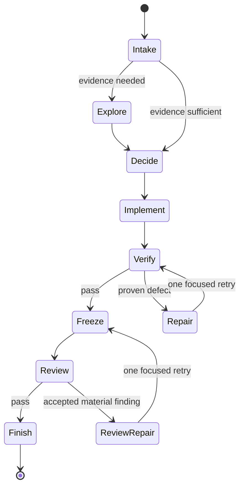

# Architecture and safety rationale

Claude Bounded Orchestrator treats a complex coding request as a finite workflow with one accountable owner.

The main Claude session remains the owner. It defines scope, chooses roles, resolves conflicting evidence, assigns exactly one writer to each path, integrates changes, freezes the candidate, triages findings, and reports the result.

## Native controls

The project uses Claude Code features for concrete limits:

- project agents live in `.claude/agents/*.md`;
- each agent has an explicit `tools` and `disallowedTools` list;
- only `implementer` includes `Edit` and `Write`;
- every child disallows `Agent`;
- `.claude/settings.json` sets `CLAUDE_CODE_MAX_SUBAGENT_SPAWN_DEPTH` to the string value `"1"`;
- optional skills use `disable-model-invocation: true` and are not preloaded into agents.

See the official Claude Code documentation for [subagents](https://code.claude.com/docs/en/sub-agents), [skills](https://code.claude.com/docs/en/skills), [shared instructions](https://code.claude.com/docs/en/memory), and [settings](https://code.claude.com/docs/en/settings).

## Instruction-level controls

Some constraints remain model instructions rather than hard security boundaries:

- role order and separation;
- one writer per assigned scope;
- candidate freezing and reviewer independence;
- repair budgets;
- exact user authority for external effects;
- evidence-only shell usage by verifier and QA roles.

Tool access is not equivalent to operating-system isolation. In particular, `Bash` can write files or trigger external effects. Verifier and QA include it because meaningful checks often need commands, but their instructions constrain it to evidence collection. Use Claude Code permission controls and normal repository protections for higher-assurance environments.

## Task ledger

The ledger stores a small JSON document at `.claude/.bounded-orchestrator/tasks.json`. The file is Git-ignored, written atomically, protected with a short-lived lock, and set to owner-only permissions where the operating system supports them.

Allowed data is deliberately narrow: task ID, short summary, role, status, dependencies, timestamps, and short evidence summary. The tool enforces length limits, dependency existence, valid state transitions, and completion gating. It does not collect prompts, source, logs, command output, credentials, or secrets.

## Finite stopping rule

The workflow permits one focused repair for a proven verification defect and one focused repair for accepted review findings. A second failure of the same contract requires new evidence, a narrower scope, an owner decision, or a stop. This keeps the process understandable and prevents unbounded agent loops.
